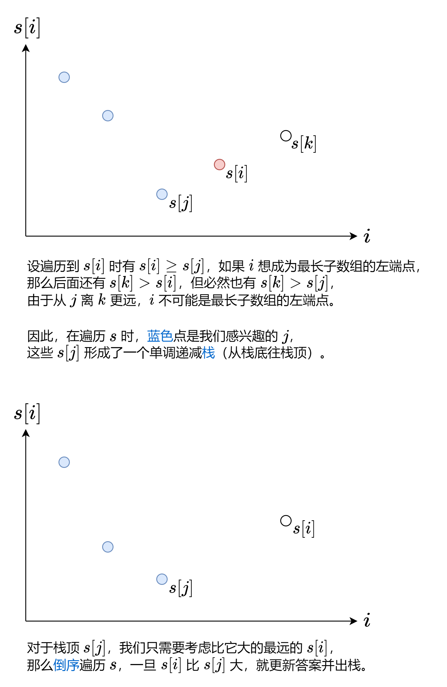

# 1124. 表现良好的最长时间段

## 前置知识：前缀和

对于数组 $nums$，定义它的前缀和 $s[0]=0,s[i+1] = \sum\limits_{j=0}^{i}nums[j]$。

例如 $nums=[1,2,−1,2]$，对应的前缀和数组为 $s=[0,1,3,2,4]$。

通过前缀和，我们可以把子数组的元素和转换成两个前缀和的差，即

$\sum\limits_{j=left}^{right}nums[j]=\sum\limits_{j=0}^{right}nums[j]-\sum\limits_{j=0}^{left-1}nums[j]=s[right+1]-s[left]$

例如 $nums$ 的子数组 $[2,−1,2]$ 的和就可以用 $s[4]−s[1]=4−1=3$ 算出来。

注：为方便计算，常用左闭右开区间 $[left,right)$ 来表示子数组，此时子数组的和为 $s[right]−s[left]$，子数组的长度为 $right−left$。

## 方法一：单调栈

先把问题转换到我们熟悉的东西上。

「劳累天数大于不劳累天数」等价于「劳累天数减去不劳累天数大于 0」。

那么把劳累的一天视作 $nums[i]=1$，不劳累的一天视作 $nums[i]=−1$，则问题变为：

计算 $nums$ 的最长子数组，其元素和大于 0。

既然说到了「子数组的元素和」，那么利用前缀和 $s$，将问题变为：

找到两个下标 $i$ 和 $j$，满足 $j<i$ 且 $s[j]<s[i]$，最大化 $i−j$ 的值。

想一想，哪些值可以作为 $j$（最长子数组的左端点）呢？

倘若有 $l1 \le l2$，并且 $s[l1] \le s[l2]$，那么 $l1$要比 $l2$更优，$l2$永远不为成为任意一个 $r$ 的候选。

特别的，当$i$为$0$时，可能成为左端点，因此，左断点是一个递减的序列



问：我怎么觉得这题和我做过的单调栈题目不太一样呢？没法快乐套模板

答：通常的单调栈题目（例如 496. 下一个更大元素 I）都是求的「最近」或「最短」，本题求的是「最长」，不能一概而论。就当成是新的模板

```cpp
int longestWPI(std::vector<int>& hours) {
  int n = hours.size();
  std::vector<int> prefix_sum(n + 1);
  int res = 0;
  std::stack<int> s;
  s.push(0);
  for (int i = 1; i <= n; ++i) {
    prefix_sum[i] = prefix_sum[i - 1] + (hours[i - 1] > 8 ? 1 : -1);
    if (prefix_sum[i] < prefix_sum[s.top()]) {
      s.push(i);
    }
  }
  for (int i = n; i >= 1; --i) {
    while (!s.empty() && prefix_sum[s.top()] < prefix_sum[i]) {
      res = std::max(res, i - s.top());
      s.pop();
    }
  }
  return res;
}
```

### 方法一复杂度分析

时间复杂度：$O(n)$，其中 $n$ 为 $hours$ 的长度。注意每个元素至多入栈出栈各一次，因此二重循环的时间复杂度是 $O(n)$ 的。

空间复杂度：$O(n)$。

## 方法二：利用前缀和的连续性

虽说方法一更加通用，不过利用 $nums$ 中只有 $1$ 和 $−1$ 的特点，可以做到一次遍历。

考虑 $s[i]$：

- 如果 $s[i]>0$，那么 $j=0$ 就是最远的左端点，因为 $s[0]=0$，故 $s[i]−s[0]=s[i]>0$，符合要求。
- 如果 $s[i] \le 0$，那么 $j$ 就是 $s[i]−1$ 首次出现的位置。为什么是 $s[i]−1$ 而不是其它更小的数？这是因为前缀和是从 $0$ 开始的，由于 $nums$ 中只有 $1$ 和 $−1$，那么相邻前缀和的差都恰好为 $1$，要想算出比 $s[i]−1$ 更小的数，必然会先算出 $s[i]−1$，那么这些更小数必然在 $s[i]−1$ 首次出现的位置的右边。

代码实现时，可以用哈希表记录每个 $s[i]$ 首次出现的下标。

```cpp
int longestWPI2(std::vector<int>& hours) {
  int n = hours.size();
  // prefix_sum[i] 表示下标[0,i)中超过8小时的个数和小于8小时个数的差
  int sum = 0;
  std::unordered_map<int, int> idxs;
  idxs[0] = 0;
  int result = 0;
  for (int i = 0; i < hours.size(); ++i) {
    if (hours[i] > 8) {
      ++sum;
    } else {
      --sum;
    }
    if (sum > 0) {
      result = std::max(result, i + 1);
    } else {
      auto it = idxs.find(sum - 1);
      if (it != idxs.end()) {
        result = std::max(result, i - it->second + 1);
      }
    }
    if (!idxs.count(sum)) {
      idxs[sum] = i + 1;
    }
  }
  return result;
}
```

### 方法二复杂度分析

时间复杂度：$O(n)$，其中 $n$ 为 $hours$ 的长度。
空间复杂度：$O(n)$。
