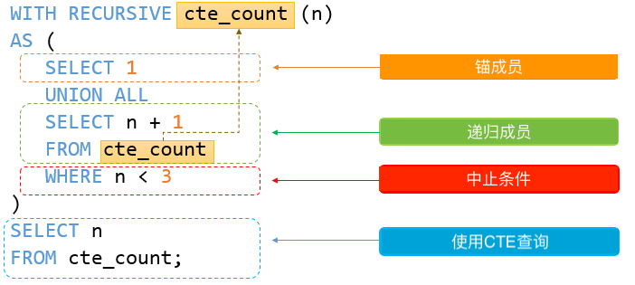

# 1613. 找到遗失的ID

题目链接：<[1613. 找到遗失的ID](https://leetcode.cn/problems/find-the-missing-ids/)>

## 思路

求出1-100的数，然后将在客户表中的数去掉，需要使用到递归CTE

```sql
with recursive nums as (
  select 1 num
  union all
  select num + 1 from nums where num < 100
)
select num as ids from nums where num not in (select customer_id from Customers) and num <= (select max(customer_id) from Customers) order by ids
```

## MySQL 递归 CTE

简介：在本教程中，您将了解MySQL递归CTE以及如何使用它来遍历分层数据。

注意：公用表表达式  或CTE仅在MySQL 8.0或更高版本中可用。因此，您应该安装正确版本的MySQL，以便使用本教程中的语句。

### MySQL递归CTE简介

递归公用表表达式（CTE）是一个CTE，它有一个子查询，它引用CTE名称本身。以下说明了递归CTE的语法

```sql
WITH RECURSIVE cte_name AS (
    initial_query  -- anchor member
    UNION ALL
    recursive_query -- 引用CTE名称的递归成员
SELECT * FROM cte_name; 
```

```sql
with recursive nums as (
    select 1 as num
    union all
    select num + 1 from nums where num < 100
)
SELECT * FROM nums; 
```

递归CTE由三个主要部分组成：

- 初始查询，形成CTE结构的基本结果集。初始查询部分称为锚成员。
- 递归查询部分是引用CTE名称的查询，因此，它被称为递归成员。递归成员由UNION ALL或UNION DISTINCT运算符与锚成员连接。
- 终止条件，确保递归成员不返回任何行时停止递归。

递归CTE的执行顺序如下：

- 首先，将成员分为两部分：锚点和递归成员。
- 接下来，执行锚成员以形成基本结果集（R0），并将此基本结果集用于下一次迭代。
- 然后，执行带有Ri结果集作为输入的递归成员并将其Ri+1作为输出。
- 之后，重复第三步，直到递归成员返回空结果集，换句话说，满足终止条件。
- 最后，使用UNION ALL运算符将结果集从R0到Rn组合。

### 递归成员限制

递归成员不得包含以下结构：

- 聚合函数，例如MAX，MIN，SUM，AVG，COUNT等。
- GROUP BY子句
- ORDER BY子句
- LIMIT 子句
- DISTINCT

注意：上述约束不适用于锚点成员。此外，禁止DISTINCT仅在您使用UNION时适用。如果您使用UNION DISTINCT，DISTINCT则允许。

此外，递归成员只能在其FROM子句中引用CTE名称一次，而不能在任何子查询中引用。

### MySQL递归CTE实例

```sql
WITH RECURSIVE cte_count (n) 
AS (
      SELECT 1
      UNION ALL
      SELECT n + 1 
      FROM cte_count 
      WHERE n < 3
    )
SELECT n 
FROM cte_count;
```

在此实例中，以下查询：

```sql
SELECT 1
```

是返回1作为基本结果集的锚成员。

以下查询

```sql
SELECT n + 1
FROM cte_count 
WHERE n < 3
```

是递归成员，因为它引用了CTE的名称cte_count。

`n < 3` 递归成员中的表达式是终止条件。一旦n等于3，递归成员将返回一个空集，该集将停止递归。

下图说明了上述CTE的要素：



递归CTE返回以下输出：

```text
+---+
| n |
+---+
| 1 |
| 2 |
| 3 |
+---+
3 rows in set (0.01 sec)
```

递归CTE的执行步骤如下：

- 首先，分离锚和递归成员。
- 接下来，锚成员形成初始行（SELECT 1），因此第一次迭代产生1 + 1 = 2，其中n = 1。
- 然后，第二次迭代对第一次迭代（2）的输出进行操作，并产生2 + 1 = 3，其中n = 2。
- 之后，在第三次操作（n = 3）之前，满足终止条件（n < 3），因此查询停止。
- 最后，使用UNION ALL运算符组合所有结果集1,2和3

### MySQL使用递归CTE遍历分层数据

我们将使用mysqldemo示例数据库中的employees表进行演示。

```text
+----------------+
| employees      |
+----------------+
| employeeNumber |
| lastName       |
| firstName      |
| extension      |
| email          |
| officeCode     |
| reportsTo      |
| jobTitle       |
+----------------+
8 rows in set (0.07 sec)
```

employees表有reportsTo引用employeeNumber字段的字段。reportsTo列存储管理员的ID。最高管理者不会向公司组织结构中的任何人报告，因此，reportsTo列中的值为NULL。

您可以应用递归CTE以自上而下的方式查询整个组织结构，如下所示：

```sql
WITH RECURSIVE employee_paths AS
  ( SELECT employeeNumber,
           reportsTo managerNumber,
           officeCode, 
           1 lvl
   FROM employees
   WHERE reportsTo IS NULL
     UNION ALL
     SELECT e.employeeNumber,
            e.reportsTo,
            e.officeCode,
            lvl+1
     FROM employees e
     INNER JOIN employee_paths ep ON ep.employeeNumber = e.reportsTo )
SELECT employeeNumber,
       managerNumber,
       lvl,
       city
FROM employee_paths ep
INNER JOIN offices o USING (officeCode)
ORDER BY lvl, city; 
```

让我们将查询分解为更小的部分，以便更容易理解。

首先，使用以下查询形成锚点成员：

```sql
SELECT 
    employeeNumber, reportsTo managerNumber, officeCode
FROM
    employees
WHERE
    reportsTo IS NULL 
```

这个查询（锚定件）返回高级经理，其reportsTo是NULL。

其次，通过引用CTE名称来创建递归成员，employee_paths在这种情况下：

```sql
SELECT 
    e.employeeNumber, e.reportsTo, e.officeCode
FROM
    employees e
        INNER JOIN
    employee_paths ep ON ep.employeeNumber = e.reportsTo 
```

此查询（递归成员）返回管理者的所有直接汇报，直到没有更多的直接汇报。如果递归成员没有返回直接报告，则递归停止。

第三，使用employee_pathsCTE 的查询将CTE返回的结果集与offices表连接，以生成最终结果集。

以下是查询的输出：

```text
+----------------+---------------+------------+-----+---------------+
| employeeNumber | managerNumber | officeCode | lvl | city          |
+----------------+---------------+------------+-----+---------------+
|           1002 |          NULL | 1          |   1 | San Francisco |
|           1056 |          1002 | 1          |   2 | San Francisco |
|           1076 |          1002 | 1          |   2 | San Francisco |
|           1143 |          1056 | 1          |   3 | San Francisco |
|           1102 |          1056 | 4          |   3 | Paris         |
|           1621 |          1056 | 5          |   3 | Beijing       |
|           1088 |          1056 | 6          |   3 | Sydney        |
...
```

## 参考资料

- [MySQL 递归 CTE](https://www.begtut.com/mysql/mysql-recursive-cte.html)
