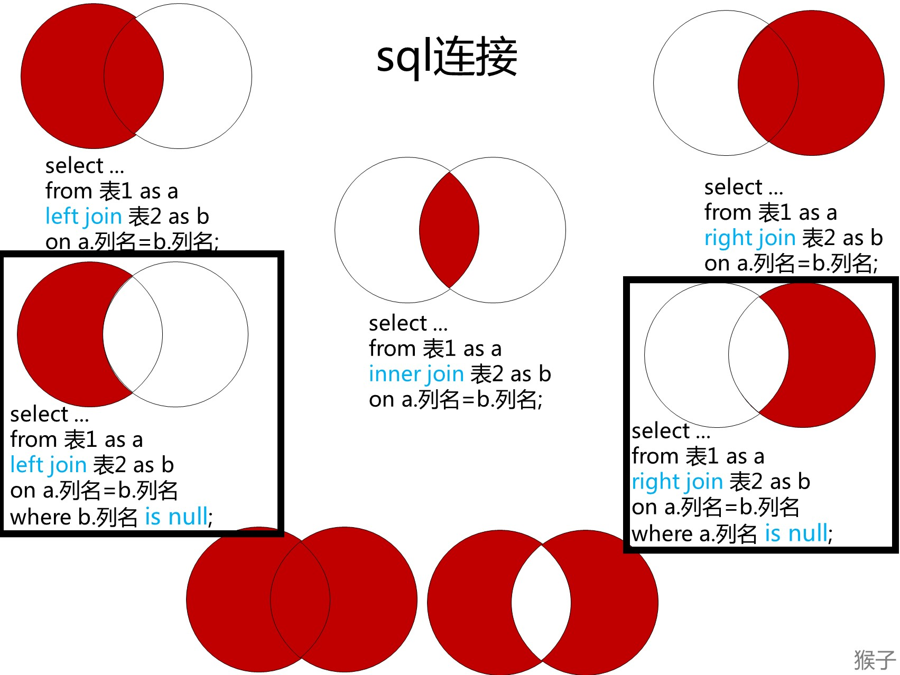

# 183 从不订购的客户

题目链接：<https://leetcode.cn/problems/customers-who-never-order/description/>

## 使用子查询和 NOT IN 子句

如果我们有一份曾经订购过的客户名单，就很容易知道谁从未订购过。

我们可以使用下面的代码来获得这样的列表。

```sql
select customerid from orders;
```

然后，我们可以使用 NOT IN 查询不在此列表中的客户。

```sql
select customers.name as 'Customers'
from customers
where customers.id not in
(
    select customerid from orders
);
```

## 左连接

### 题目

下面是学生的名单，表名为“学生表”；近视学生的名单，表名为“近视学生表”。请问不是近视眼的学生都有谁？ （“学生表”表中的学号与“近视学生”表中的学生学号一一对应）


### 解题思路

我们先来拆解问题：不是近视眼的学生都有谁？

1）“不是近视眼”的学生，近视信息在“近视学生”表里
2） “学生都有谁？”，要求的是“学生姓名”，所以我们的输出答案应该是“学生姓名”，这在“学生”表里。

涉及2张以上表的查询时，我们需要用到多表联结。

使用哪种联结呢？ 在《从零学会SQL：多表查询》这个课里我讲过各个联结的情况：



其中上图黑色框里的sql解决的问题是：不在表里的数据，也就是在表A里的数据，但是不在表B里的数据。

对于这个题目“不是近视眼的学生都有谁？”，就是在“学生表”里的数据，但是不在“近视学生”表里的数据。我们选择下图黑色框里的左联结sql语句。


```sql
select field1 from table1 as a left join table2 as b on a.field1=b.field2 where b.field2 is null;​
```

多表如何联结？ 题目已给出，联结两表的关键依据分别为“学号”和“学生学号”。示意图如下：


### 解题步骤

使用分析思路里的sql语句联结两表

```sql
select a.姓名 as 不近视的学生名单 from 学生表 as a left join 近视学生表 as b on a.学号=b.学生学号 where b.序号 is null;
```

我们来理解下这个sql的运行过程，方便你更深入的理解。

- 在不加where字句的情况下，两表联结得到下图的表


- 假设where字句（where b.序号 is null;）就会把b.序号这一列里为空值（NULL）的行选出来，就是题目要求的不近视的学生。（下图绿色框里的行）


### 本题考点

本题主要考察多表联结。

遇到要查找“不在表里的数据，也就是在表A里的数据，但是不在表B里的数据。”可以使用下图黑框里的sql语句。


### 举一反三

查找“不在表里的数据”应用案例：

某网站包含两个表，顾客姓名表（表名Customers）和 购买记录表（表名Orders）。找出所有从不订购任何东西的客户。

（“顾客姓名表”中的ID与“购买记录”表中的学生学号CustomerId一一对应）


参考答案

```sql
select a.Name as Customers from Customers as a left join Orders as b on a.Id=b.CustomerId where b.CustomerId is null;
```

输出结果


