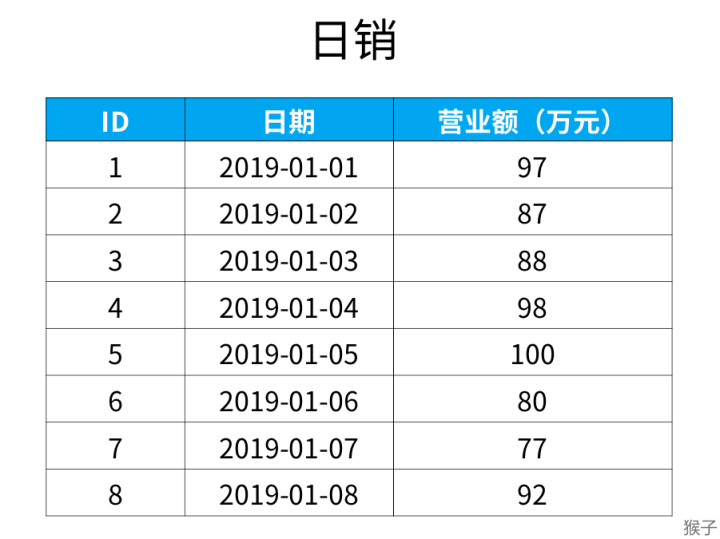
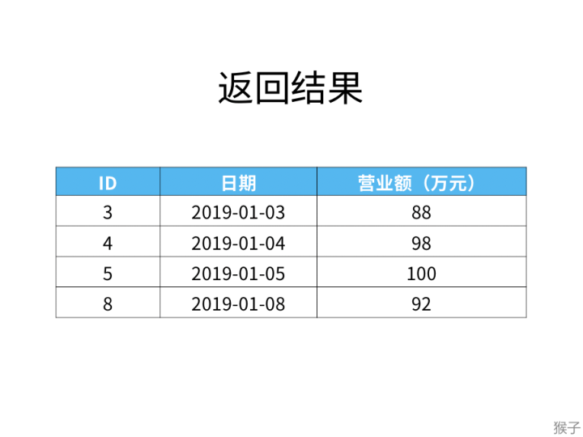
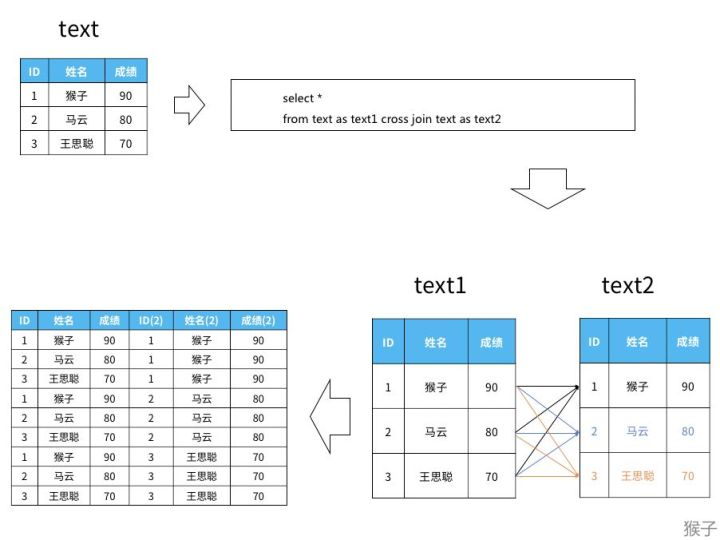
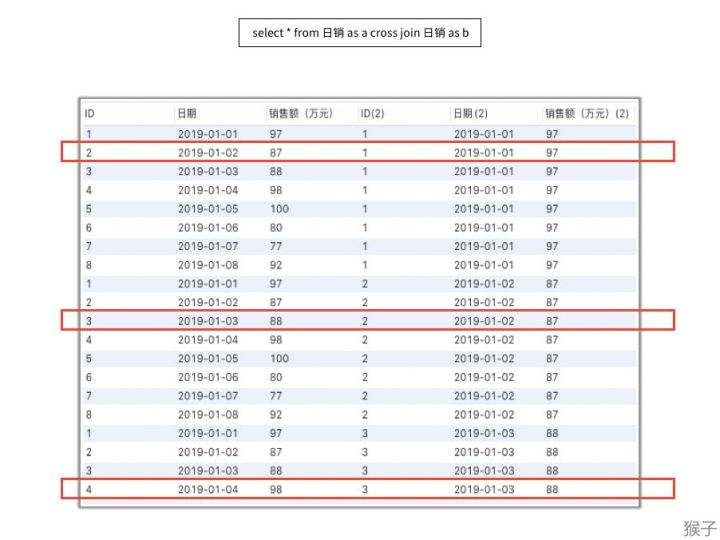
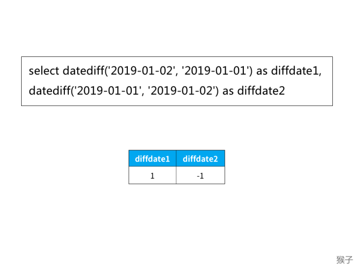
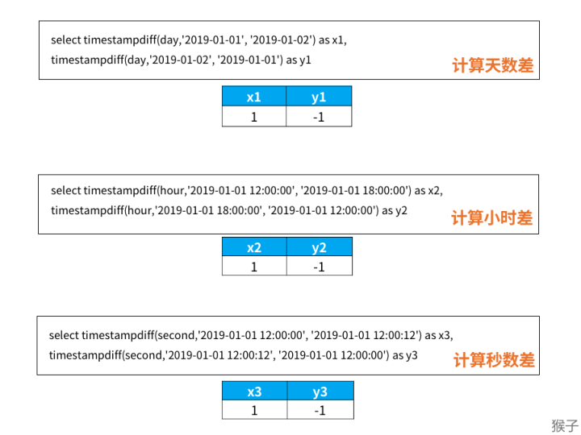
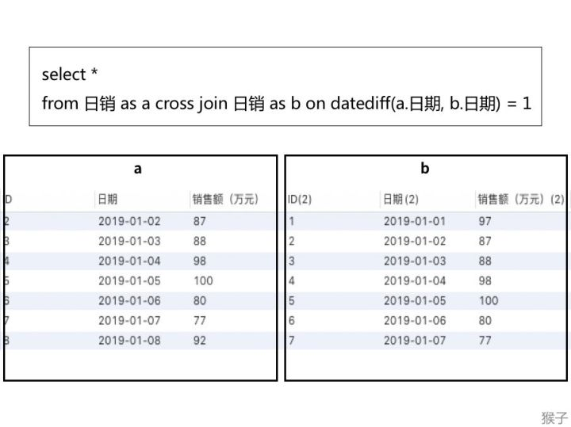
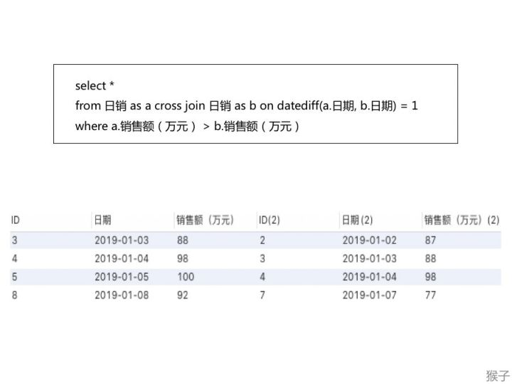
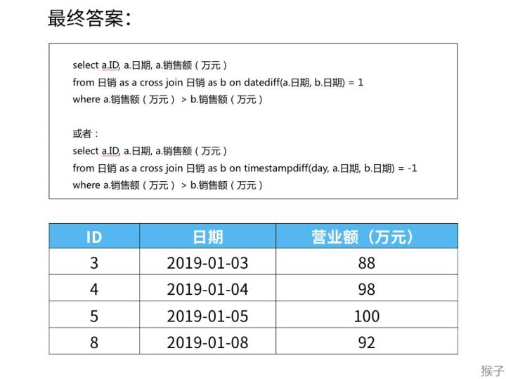

# 197 上升的温度

题目链接：<https://leetcode.cn/problems/rising-temperature/description/>

## 使用inner join

join默认是inner join

```sql
select a.id from Weather a, Weather b where a.recordDate = date_add(b.recordDate, interval 1 day) and a.Temperature > b.Temperature;

select a.id from Weather a join Weather b on a.recordDate = date_add(b.recordDate, interval 1 day) and a.Temperature > b.Temperature;
```

## 题目

下面是某公司每天的营业额，表名为“日销”。“日期”这一列的数据类型是日期类型（date）。



请找出所有比前一天（昨天）营业额更高的数据。（前一天的意思，如果“当天”是1月，“昨天”（前一天）就是1号）

例如需要返回一下结果：



## 解题思路

### 交叉联结

首先我们来复习一下之前课程《从零学会sql》里讲过的交叉联结（cross join）的概念。

使用交叉联结会将两个表中所有的数据两两组合。如下图，是对表“text”自身进行交叉联结的结果：



直接使用交叉联结的业务需求比较少见，往往需要结合具体条件，对数据进行有目的的提取，本题需要结合的条件就是“前一天”。

本题的日销表交叉联结的结果（部分）如下。这个交叉联结的结果表，可以看作左边三列是表a，右边三列是表b。



红色框中的每一行数据，左边是“当天”数据，右边是“前一天”的数据。比如第一个红色框中左边是“当天”数据（2号），右边是“前一天”的数据（1号）。

题目要求，销售额条件是：“当天” > “昨天”（前一天）。所以，对于上面的表，我们只需要找到表a中销售额（当天）大于b中销售额（昨天）的数据。

### 日期比较函数

另一个需要着重去考虑的，就是如何找到 “昨天”（前一天），这里为大家介绍两个时间计算的函数：

```text
datediff(日期1, 日期2)
```

得到的结果是日期1与日期2相差的天数。 如果日期1比日期2大，结果为正；如果日期1比日期2小，结果为负。

例如：日期1（2019-01-02），日期2（2019-01-01），两个日期在函数里互换位置，就是下面的结果



另一个关于时间计算的函数是：

```text
timestampdiff(时间类型, 日期1, 日期2)
```

这个函数和上面diffdate的正、负号规则刚好相反。 日期1大于日期2，结果为负，日期1小于日期2，结果为正。

在“时间类型”的参数位置，通过添加“day”, “hour”, “second”等关键词，来规定计算天数差、小时数差、还是分钟数差。示例如下图：



## 解题步骤

- 将日销表进行交叉联结


- 选出上图红框中的“a.日期比b.日期大一天”
- 可以使用“diffdate(a.日期, b.日期) = 1”或者“timestampdiff(day, a.日期, b.日期) = -1”，以此为基准，提取表中的数据，这里先用diffdate进行操作。

```sql
select *
from 日销 as a cross join 日销 as b 
     on datediff(a.日期, b.日期) = 1;
```



- 找出a中销售额大于b中销售额的数据

```text
where a.销售额（万元） > b.销售额（万元）
```



- 删掉多余数据

题目只需要找销售额大于前一天的ID、日期、销售额，不需要上表那么多数据。所以只需要提取中上表的ID、日期、销售额（万元）列。 结合一开始提到的两个处理时间的方法，最终答案及结果如下：

```sql
select a.ID, a.日期, a.销售额（万元）
from 日销 as a cross join 日销 as b 
     on datediff(a.日期, b.日期) = 1
where a.销售额（万元） > b.销售额（万元）;

select a.ID, a.日期, a.销售额（万元）
from 日销 as a cross join 日销 as b 
     on timestampdiff(day, a.日期, b.日期) = -1
where a.销售额（万元） > b.销售额（万元）;
```



## 本题参考答案

```sql
select a.id
from Weather as a cross join Weather as b 
     on timestampdiff(day, a.recordDate, b.recordDate) = -1
where a.temperature > b.temperature;
```

## 日期函数

### 获得当前日期时间

#### now()

获得当前日期+时间（date + time）函数：now()

```sql
mysql> select now();

+---------------------+
| now() |
+---------------------+
| 2008-08-08 22:20:46 |
+---------------------+
```

#### sysdate()

获得当前日期+时间（date + time）函数：sysdate()
sysdate() 日期时间函数跟 now() 类似，不同之处在于：now() 在执行开始时值就得到了， sysdate() 在函数执行时动态得到值。
sysdate() 日期时间函数，一般情况下很少用到。

看下面的例子就明白了：

```sql
mysql> select now(), sleep(3), now();
+---------------------+----------+---------------------+
| now()               | sleep(3) | now()               |
+---------------------+----------+---------------------+
| 2023-01-06 14:57:23 |        0 | 2023-01-06 14:57:23 |
+---------------------+----------+---------------------+
1 row in set (3.08 sec)

mysql> select sysdate(), sleep(3), sysdate();
+---------------------+----------+---------------------+
| sysdate()           | sleep(3) | sysdate()           |
+---------------------+----------+---------------------+
| 2023-01-06 14:57:40 |        0 | 2023-01-06 14:57:43 |
+---------------------+----------+---------------------+
1 row in set (3.07 sec)
```

#### current_timestamp()

MySQL 获得当前时间戳函数：current_timestamp, current_timestamp()

```sql
mysql> select current_timestamp, current_timestamp();
+---------------------+---------------------+
| current_timestamp   | current_timestamp() |
+---------------------+---------------------+
| 2023-01-06 15:00:32 | 2023-01-06 15:00:32 |
+---------------------+---------------------+
1 row in set (0.00 sec)
```

### 日期转换函数和时间转换函数

#### date_format(date,format)和time_format(time,format)

MySQL Date/Time to Str（日期/时间转换为字符串）函数：date_format(date,format), time_format(time,format)
MySQL 日期、时间转换函数：date_format(date,format), time_format(time,format) 能够把一个日期/时间转换成各种各样的字符串格式。它是 str_to_date(str,format) 函数的 一个逆转换。

```sql
mysql> select date_format('2008-08-08 22:23:01', '%Y%m%d%H%i%s');
+----------------------------------------------------+
| date_format('2008-08-08 22:23:01', '%Y%m%d%H%i%s') |
+----------------------------------------------------+
| 20080808222301                                     |
+----------------------------------------------------+
1 row in set (0.01 sec)
```

#### str_to_date(str, format)

MySQL Str to Date （字符串转换为日期）函数：str_to_date(str, format)

```sql
select str_to_date('08/09/2008', '%m/%d/%Y'); -- 2008-08-09
select str_to_date('08/09/08' , '%m/%d/%y'); -- 2008-08-09
select str_to_date('08.09.2008', '%m.%d.%Y'); -- 2008-08-09
select str_to_date('08:09:30', '%h:%i:%s'); -- 08:09:30
select str_to_date('08.09.2008 08:09:30', '%m.%d.%Y %h:%i:%s'); -- 2008-08-09 08:09:30
```

可以看到，str_to_date(str,format) 转换函数，可以把一些杂乱无章的字符串转换为日期格式。另外，它也可以转换为时间。“format” 可以参看 MySQL 手册。

#### to_days(date), from_days(days)

MySQL （日期、天数）转换函数：to_days(date), from_days(days)

```sql
select to_days('0000-00-00'); -- 0
select to_days('2008-08-08'); -- 733627
```

#### time_to_sec(time), sec_to_time(seconds)

MySQL （时间、秒）转换函数：time_to_sec(time), sec_to_time(seconds)

```sql
select time_to_sec('01:00:05'); -- 3605
select sec_to_time(3605); -- '01:00:05'
```

#### makdedate(year,dayofyear), maketime(hour,minute,second)

MySQL 拼凑日期、时间函数：makdedate(year,dayofyear), maketime(hour,minute,second)

```sql
select makedate(2001,31); -- '2001-01-31'
select makedate(2001,32); -- '2001-02-01'
select maketime(12,15,30); -- '12:15:30'
```

#### Unix 时间戳、日期）转换函数

```sql
unix_timestamp(),
unix_timestamp(date),
from_unixtime(unix_timestamp),
from_unixtime(unix_timestamp,format)

select unix_timestamp(); -- 1218290027
select unix_timestamp('2008-08-08'); -- 1218124800
select unix_timestamp('2008-08-08 12:30:00'); -- 1218169800

select from_unixtime(1218290027); -- '2008-08-09 21:53:47'
select from_unixtime(1218124800); -- '2008-08-08 00:00:00'
select from_unixtime(1218169800); -- '2008-08-08 12:30:00'

select from_unixtime(1218169800, '%Y %D %M %h:%i:%s %x'); -- '2008 8th August 12:30:00 2008'
```

### 日期时间计算函数

#### date_add()

MySQL 为日期增加一个时间间隔：date_add()

```sql
set @dt = now();

select date_add(@dt, interval 1 day); -- add 1 day
select date_add(@dt, interval 1 hour); -- add 1 hour
select date_add(@dt, interval 1 minute); -- ...
select date_add(@dt, interval 1 second);
select date_add(@dt, interval 1 microsecond);
select date_add(@dt, interval 1 week);
select date_add(@dt, interval 1 month);
select date_add(@dt, interval 1 quarter);
select date_add(@dt, interval 1 year);

select date_add(@dt, interval -1 day); -- sub 1 day
```

MySQL adddate(), addtime()函数，可以用 date_add() 来替代。下面是 date_add() 实现 addtime() 功能示例：

```sql
mysql> set @dt = '2008-08-09 12:12:33';

mysql>
mysql> select date_add(@dt, interval '01:15:30' hour_second);

+------------------------------------------------+
| date_add(@dt, interval '01:15:30' hour_second) |
+------------------------------------------------+
| 2008-08-09 13:28:03 |
+------------------------------------------------+

mysql> select date_add(@dt, interval '1 01:15:30' day_second);

+-------------------------------------------------+
| date_add(@dt, interval '1 01:15:30' day_second) |
+-------------------------------------------------+
| 2008-08-10 13:28:03 |
+-------------------------------------------------+
```

#### date_sub()

MySQL 为日期减去一个时间间隔：date_sub()

```sql
mysql> select date_sub('1998-01-01 00:00:00', interval '1 1:1:1' day_second);

+----------------------------------------------------------------+
| date_sub('1998-01-01 00:00:00', interval '1 1:1:1' day_second) |
+----------------------------------------------------------------+
| 1997-12-30 22:58:59 |
+----------------------------------------------------------------+
```

MySQL date_sub() 日期时间函数 和 date_add() 用法一致，不再赘述。

#### datediff(date1,date2), timediff(time1,time2)

```sql
MySQL datediff(date1,date2)：两个日期相减 date1 - date2，返回天数。
select datediff('2008-08-08', '2008-08-01'); -- 7
select datediff('2008-08-01', '2008-08-08'); -- -7
```

MySQL timediff(time1,time2)：两个日期相减 time1 - time2，返回 time 差值。

```sql
select timediff('2008-08-08 08:08:08', '2008-08-08 00:00:00'); -- 08:08:08
select timediff('08:08:08', '00:00:00'); -- 08:08:08
```

注意：timediff(time1,time2) 函数的两个参数类型必须相同。

#### 时间戳（timestamp）转换、增、减函数

```sql
timestamp(date) -- date to timestamp
timestamp(dt,time) -- dt + time
timestampadd(unit,interval,datetime_expr) --
timestampdiff(unit,datetime_expr1,datetime_expr2) --

select timestamp('2008-08-08'); -- 2008-08-08 00:00:00
select timestamp('2008-08-08 08:00:00', '01:01:01'); -- 2008-08-08 09:01:01
select timestamp('2008-08-08 08:00:00', '10 01:01:01'); -- 2008-08-18 09:01:01

select timestampadd(day, 1, '2008-08-08 08:00:00'); -- 2008-08-09 08:00:00
select date_add('2008-08-08 08:00:00', interval 1 day); -- 2008-08-09 08:00:00

MySQL timestampadd() 函数类似于 date_add()。
select timestampdiff(year,'2002-05-01','2001-01-01'); -- -1
select timestampdiff(day ,'2002-05-01','2001-01-01'); -- -485
select timestampdiff(hour,'2008-08-08 12:00:00','2008-08-08 00:00:00'); -- -12

select datediff('2008-08-08 12:00:00', '2008-08-01 00:00:00'); -- 7
```

MySQL timestampdiff() 函数就比 datediff() 功能强多了，datediff() 只能计算两个日期（date）之间相差的天数。

### 时区（timezone）转换函数

```sql
convert_tz(dt,from_tz,to_tz)

select convert_tz('2008-08-08 12:00:00', '+08:00', '+00:00'); -- 2008-08-08 04:00:00
```

时区转换也可以通过 date_add, date_sub, timestampadd 来实现。

```sql
select date_add('2008-08-08 12:00:00', interval -8 hour); -- 2008-08-08 04:00:00
select date_sub('2008-08-08 12:00:00', interval 8 hour); -- 2008-08-08 04:00:00
select timestampadd(hour, -8, '2008-08-08 12:00:00'); -- 2008-08-08 04:00:00
```
